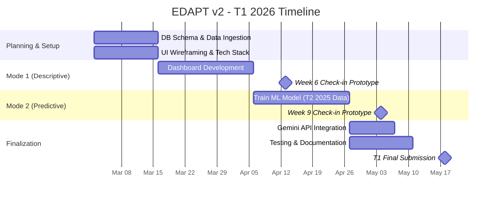
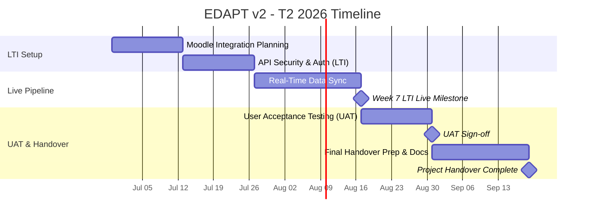

## 📅 Project Timeline

### Phase 1: T1 2026 (Core Development)
This phase focuses on building the foundational database, Mode 1 (Descriptive Dashboard), and Mode 2 (Predictive Engine).

### Phase 2: T2 2026 (Live Integration & Handover)
This future phase focuses on integrating the system with Moodle via LTI and handing the project over to KOI IT.
