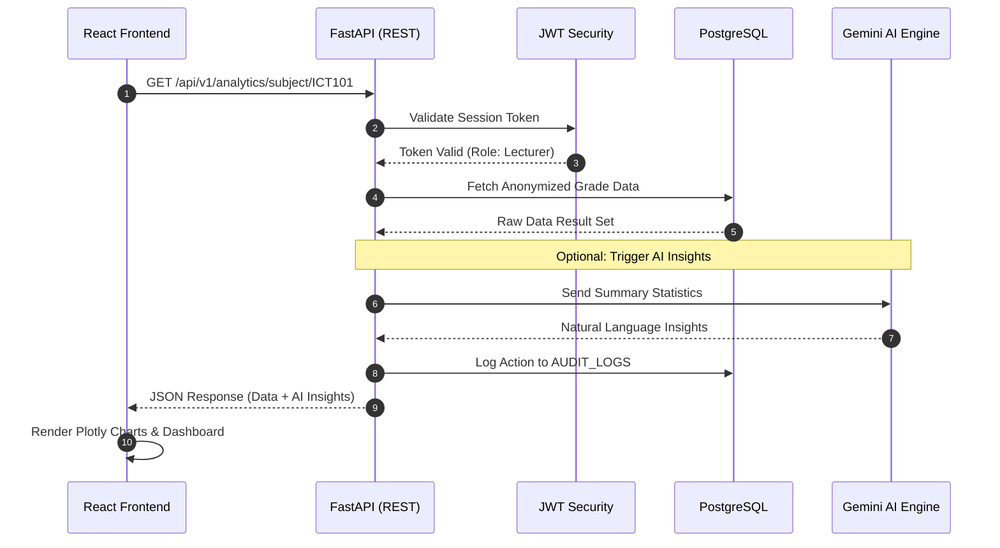
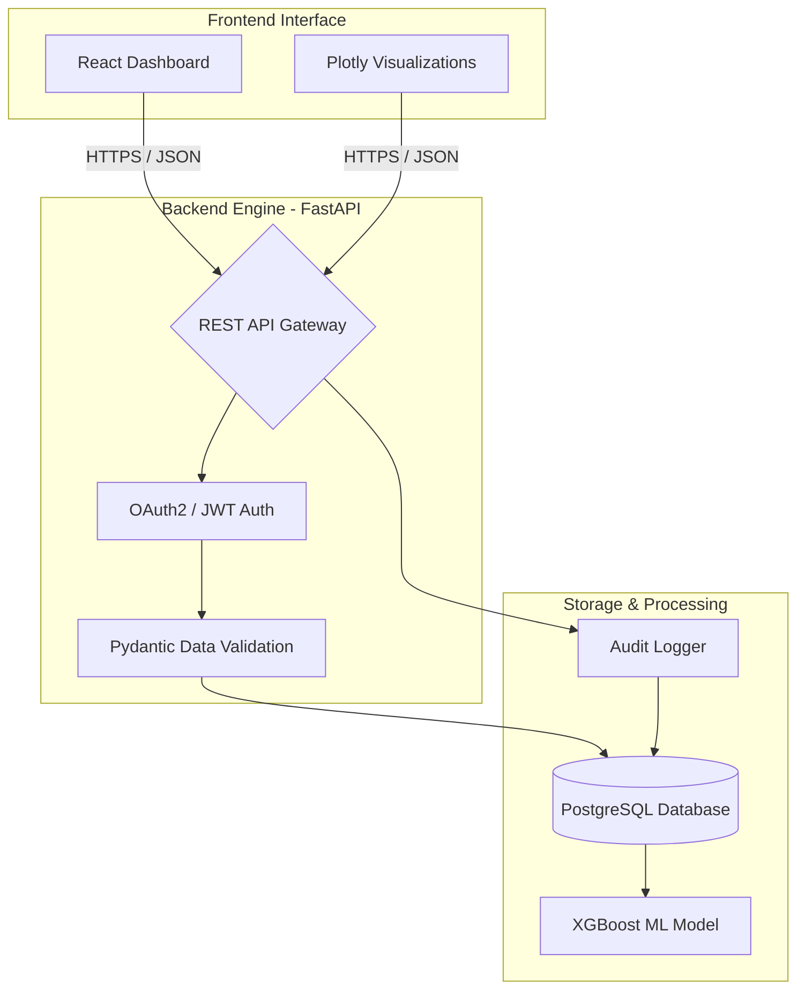

# EDAPT v2 | Technical Architecture & API Design

This document outlines the system flow, data structures, and API endpoints for the EDAPT v2 Capstone project.

## 1. System Sequence Diagram
This diagram visualizes how the Frontend, FastAPI, and PostgreSQL database interact during a standard user request.

## 2. Production API Architecture
The following diagram represents the "Security Gateway" design of our REST API.
